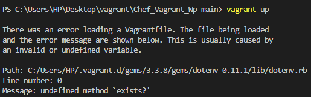
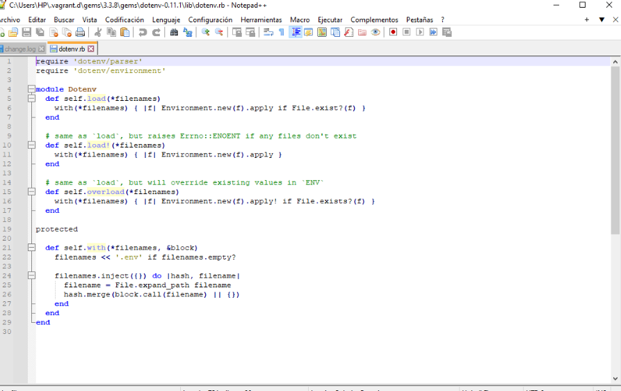
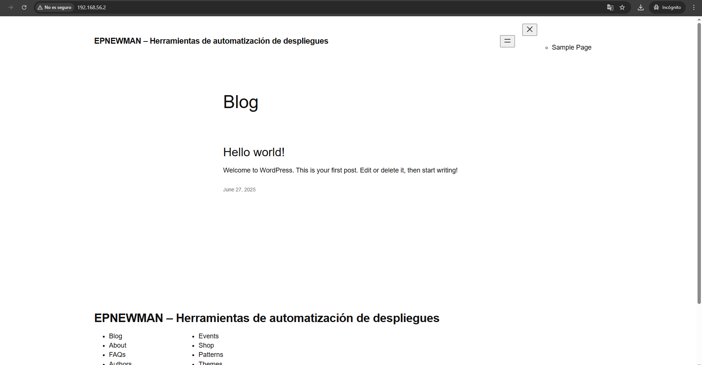
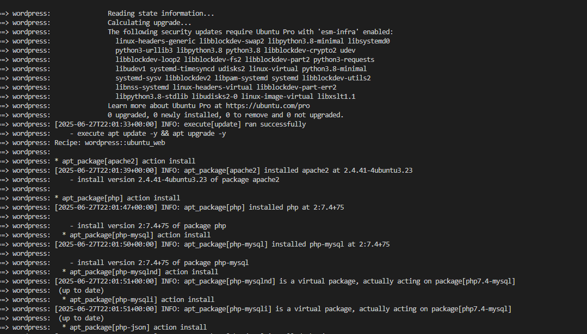
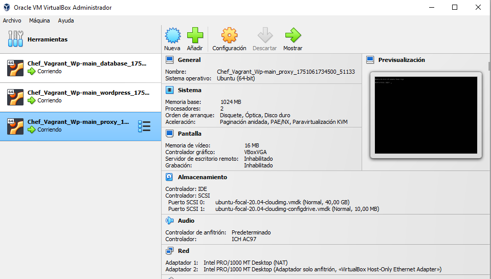
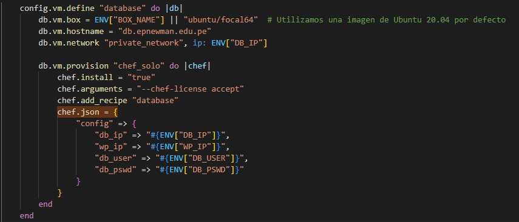
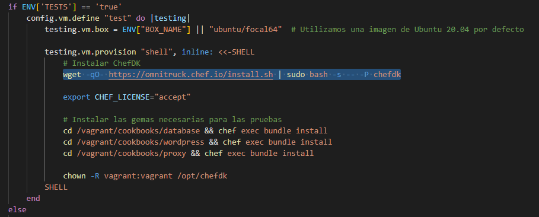
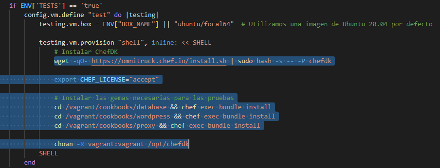
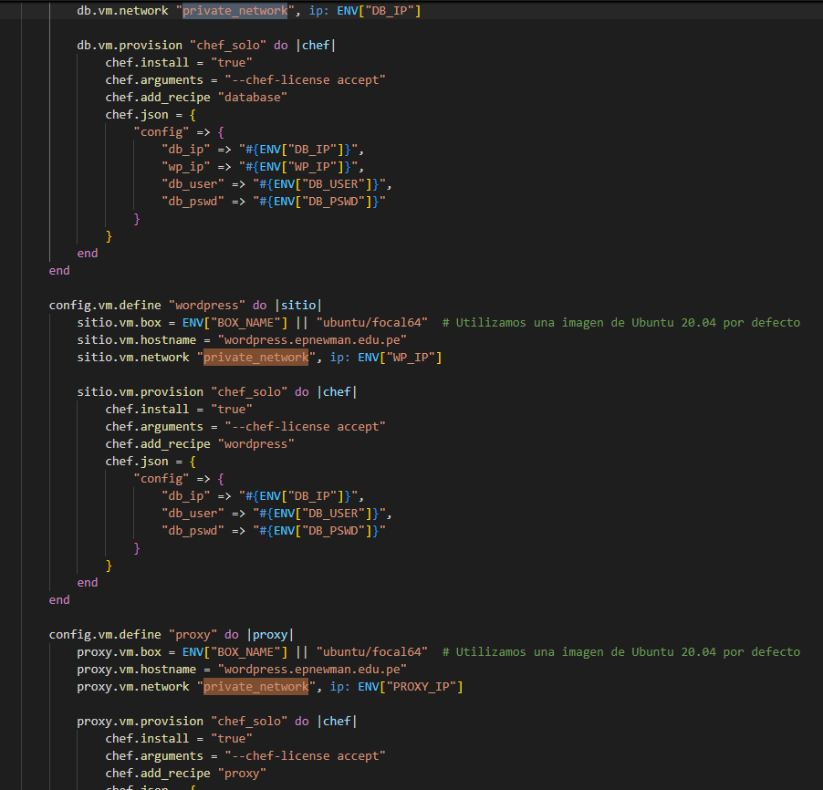
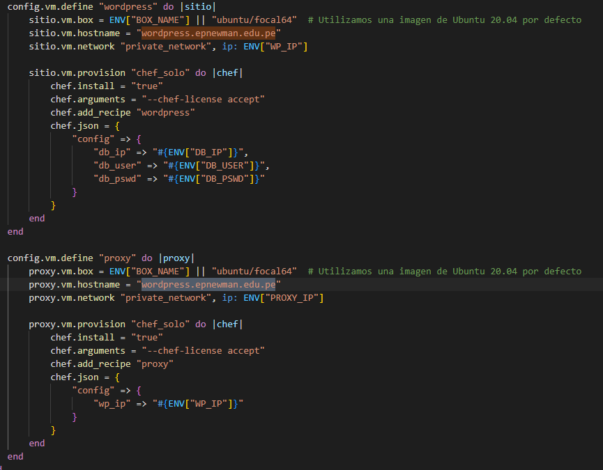

# INFORME FINAL DE AUDITORÍA DE SISTEMAS
**Entidad Auditada:** DevIA360  
**Ubicación:** Tacna, Tacna, Tacna  
**Período auditado:** 27/06/2025 hasta 27/06/2025  
**Equipo Auditor:** Jhonny Rivera Mendoza
**Fecha del informe:** 27/06/2025  

## ÍNDICE

1. [Resumen Ejecutivo](#1-resumen-ejecutivo)  
2. [Antecedentes](#2-antecedentes)  
3. [Objetivos de la Auditoría](#3-objetivos-de-la-auditoría)  
4. [Alcance de la Auditoría](#4-alcance-de-la-auditoría)  
5. [Normativa y Criterios de Evaluación](#5-normativa-y-criterios-de-evaluación)  
6. [Metodología y Enfoque](#6-metodología-y-enfoque)  
7. [Hallazgos y Observaciones](#7-hallazgos-y-observaciones)  
8. [Análisis de Riesgos](#8-análisis-de-riesgos)  
9. [Recomendaciones](#9-recomendaciones)  
10. [Conclusiones](#10-conclusiones)  
11. [Plan de Acción y Seguimiento](#11-plan-de-acción-y-seguimiento)  
12. [Anexos](#12-anexos)  

## 1. RESUMEN EJECUTIVO

Este apartado se desarrolla al final de la auditoría realizada y es una descripción breve y concisa del propósito de la auditoría, principales hallazgos, conclusiones y recomendaciones más relevantes.

## 2. ANTECEDENTES

DevIA360 es una empresa especializada en soluciones tecnológicas avanzadas, ofreciendo servicios de despliegue y gestión automatizada de aplicaciones web para sus clientes. Para agilizar sus operaciones, DevIA360 utiliza la solución Chef_Vagrant_Wp (https://github.com/OscarJimenezFlores/Chef_Vagrant_Wp.git), una herramienta que automatiza el despliegue de entornos de Wordpress mediante el uso de Vagrant y Chef.
Este sistema de despliegue continuo es crítico para asegurar que los entornos sean confiables, homogéneos y seguros en la provisión de servicios. A través de este enfoque, DevIA360 busca mejorar la eficiencia operativa y garantizar la coherencia en la configuración de sus entornos de desarrollo, prueba y producción.

Anteriormente se le hizo una auditoria pero esta no fue completada. debido a que no se llego a terminar el informe final.

## 3. OBJETIVOS DE LA AUDITORÍA

### Objetivo general
Evaluar los controles de seguridad, configuración y cumplimiento implementados en la infraestructura de desarrollo y despliegue automatizado basada en Vagrant y Chef de la empresa DevIA360 S.A.C., identificando vulnerabilidades, deficiencias de configuración y riesgos asociados a la confidencialidad, integridad y disponibilidad de la información.
### Objetivos especificos

- Verificar la implementación de mecanismos de protección de datos sensibles (credenciales y configuraciones).

- Evaluar el cumplimiento de buenas prácticas en la gestión de configuraciones y aprovisionamiento automatizado.

- Analizar la seguridad en la infraestructura de red y segmentación del entorno virtual.

- Determinar la adecuación del entorno al marco normativo y políticas internas.

- Identificar riesgos de continuidad operativa y trazabilidad en procesos CI/CD.

## 4. ALCANCE DE LA AUDITORÍA
La auditoría comprenderá el análisis técnico y documental de los sistemas de desarrollo y despliegue automático utilizados por DevIA360 S.A.C., focalizado en el entorno de virtualización Vagrant y las configuraciones empleadas mediante ChefDK.

### Componentes revisados:

- Archivos de configuración Vagrantfile y cookbooks asociados.

- Control de versiones y manejo de entornos (producción/pruebas).

- Variables de entorno, credenciales y protección de secretos.

- Proceso de aprovisionamiento e instalación automatizada de software.

- Topología de red virtual y configuración de acceso.

### Ámbitos evaluados

- Tecnológico (configuración de sistemas, redes, automatización)

- Organizacional (gestión de configuración, control de versiones)

- Normativo (cumplimiento de estándares de seguridad de la información)

### Unidades auditadas

- Área de desarrollo

- Área de infraestructura y operaciones

- Periodo auditado

- Primer semestre del año 2025 (enero-junio)

## 5. NORMATIVA Y CRITERIOS DE EVALUACIÓN

- ISO/IEC 27001:2022 - Gestión de Seguridad de la Información

- ISO/IEC 27002:2022 - Controles de seguridad de la información

- NIST SP 800-53 Rev.5 - Controles de seguridad y privacidad

- OWASP DevSecOps Maturity Model

- Ley N° 29733 - Ley de Protección de Datos Personales (Perú)

- Políticas internas de TI de DevIA360 S.A.C.

## 6. METODOLOGÍA Y ENFOQUE

Descripción del enfoque utilizado (basado en riesgos, cumplimiento, mixto) y métodos aplicados:

### Enfoque
Basado en riesgos y cumplimiento

### Metodos aplicados
- Revisión de configuraciones y código (Vagrantfile, Chef recipes)

- Inspección de documentos y políticas internas

- Pruebas técnicas de configuración, seguridad de red y aprovisionamiento

- Análisis de dependencias y binarios utilizados en instalación automatizada

- Aplicación de listas de verificación (checklists basados en ISO 27001/NIST)

## 7. HALLAZGOS Y OBSERVACIONES

### Hallazgo 1: Exposición de credenciales en texto plano
Anexo: [Hallazgo 1: Exposición de credenciales en texto plano](#hallazgo-1-evidencia-exposición-de-credenciales-en-texto-plano)
| Elemento | Descripción |
|---------|-------------|
| Evidencia | Uso directo de variables DB_USER, DB_PSWD en archivos JSON de Chef. |
| Criticidad | Alta |
| Criterio vulnerado | ISO 27002 - 8.2.3 (Gestión de información confidencial) |
| Causa | Falta de mecanismo seguro para manejo de secretos |
| Efecto | Riesgo de acceso no autorizado a la base de datos |

### Hallazgo 2: Instalación de ChefDK sin validación de integridad
Anexo: [Hallazgo 2: Instalación de ChefDK sin validación de integridad](#hallazgo-2-evidencia-instalación-de-chefdk-sin-validación-de-integridad)
| Elemento | Descripción |
|---------|-------------|
| Evidencia | Uso de script remoto sin validación (wget | bash) |
| Criticidad | Alta |
| Criterio vulnerado | NIST SI-7 (Protección contra modificaciones maliciosas) |
| Causa | Práctica de instalación insegura |
| Efecto | Riesgo de ataque tipo supply-chain |

### Hallazgo 3: Uso de herramienta obsoleta (ChefDK)
Anexo: [Hallazgo 3: Uso de herramienta obsoleta (ChefDK)](#hallazgo-3-evidencia-uso-de-herramienta-obsoleta-chefdk)

| Elemento | Descripción |
|---------|-------------|
| Evidencia | ChefDK sin soporte oficial ni actualizaciones desde 2020 |
| Criticidad | Media |
| Criterio vulnerado | ISO 27002 - 12.1.2 (Gestión de vulnerabilidades) |
| Causa | Dependencia de herramientas sin mantenimiento |
| Efecto | Exposición a vulnerabilidades sin parches |

### Hallazgo 4: Segmentación de red insuficiente
Anexo: [Hallazgo 4: Segmentación de red insuficiente](#hallazgo-4-evidencia-segmentación-de-red-insuficiente)

| Elemento | Descripción |
|---------|-------------|
| Evidencia | Red compartida entre servicios críticos sin reglas de control |
| Criticidad | Media |
| Criterio vulnerado | ISO 27002 - 13.1.3 (Segmentación de red) |
| Causa | Falta de segmentación lógica |
| Efecto | Riesgo de movimiento lateral entre servicios |

### Hallazgo 5: Ambigüedad en hostname de máquinas virtuales
Anexo: [Hallazgo 5: Ambigüedad en hostname de máquinas virtuales](#hallazgo-5-evidencia-ambigüedad-en-hostname-de-máquinas-virtuales)

| Elemento | Descripción |
|---------|-------------|
| Evidencia | Doble asignación del FQDN "wordpress.epnewman.edu.pe" |
| Criticidad | Baja |
| Criterio vulnerado | ISO 27002 - 8.1.1 (Identificación de activos) |
| Causa | Error de configuración |
| Efecto | Conflictos DNS o validación TLS |

## 8. ANÁLISIS DE RIESGOS

Evaluación del impacto y probabilidad de los riesgos identificados, asociados a los hallazgos encontrados.

| Riesgo                              | Causa (Vínculo a Hallazgo)                                                                 | Impacto | Probabilidad (%) | Nivel de Riesgo |
|-------------------------------------|---------------------------------------------------------------------------------------------|---------|------------------|------------------|
| Exposición de credenciales sensibles | [Hallazgo 1: Falta de manejo seguro de secretos](#hallazgo-1-exposición-de-credenciales-en-texto-plano) | Alto    | 90%              | Crítico          |
| Instalación sin validación de integridad | [Hallazgo 2: Práctica de instalación insegura](#hallazgo-2-instalación-de-chefdk-sin-validación-de-integridad) | Alto    | 80%              | Alto             |
| Dependencia de herramienta obsoleta | [Hallazgo 3: Uso de ChefDK sin soporte](#hallazgo-3-uso-de-herramienta-obsoleta-chefdk)    | Medio   | 70%              | Medio            |
| Falta de segmentación de red        | [Hallazgo 4: Red compartida sin aislamiento lógico](#hallazgo-4-segmentación-de-red-insuficiente) | Medio   | 80%              | Medio            |
| Ambigüedad en hostname              | [Hallazgo 5: FQDN duplicado en entorno virtual](#hallazgo-5-ambigüedad-en-hostname-de-máquinas-virtuales) | Bajo    | 50%              | Bajo             |

## 9. RECOMENDACIONES
Se emite la tabla de recomendaciones asociada al responsable de cada area.
| Hallazgo | Recomendación | Responsable |
|----------|------------------|------------------------|
| 1 | Implementar mecanismos de gestión de secretos como Chef Encrypted Data Bags o HashiCorp Vault. | Área de Seguridad de la Información |
| 2 | Descargar y verificar binarios mediante SHA-256 o GPG antes de instalación. | Área de Infraestructura o Sistemas |
| 3 | Migrar a Chef Workstation o herramientas modernas soportadas. | Área de Desarrollo o DevOps |
| 4 | Crear subredes separadas para cada rol (DB, Web, Proxy) e implementar firewalls internos. | Área de Redes y Comunicaciones |
| 5 | Asignar nombres de host únicos y consistentes por cada VM. | Área de Infraestructura o DevOps |

## 10. CONCLUSIONES
La configuración actual del entorno de despliegue presenta deficiencias importantes en el manejo de credenciales, validación de software instalado y segmentación de red. Los controles de seguridad son limitados y no están alineados con las buenas prácticas y normas vigentes, lo que expone a la organización a riesgos operacionales y de seguridad significativos. Es imperativo fortalecer los mecanismos de seguridad y revisión periódica del entorno.

## 11. PLAN DE ACCIÓN Y SEGUIMIENTO

| Hallazgo | Recomendación | Responsable | Fecha Comprometida |
|----------|----------------|-------------|---------------------|
| 1        | Gestión segura de secretos | DevSecOps Lead | 15/07/2025 |
| 2        | Validar binarios antes de instalar | Administrador de sistemas | 15/07/2025 |
| 3        | Migrar a Chef Workstation | Equipo de Desarrollo | 31/07/2025 |
| 4        | Aplicar segmentación de red | Infraestructura y Redes | 31/07/2025 |
| 5        | Corregir nombres de host duplicados | Equipo DevOps | 10/07/2025 |

## 12. ANEXOS
### Evidencia de instalacion y dificultades
#### Problemas al instalar
Problema de configuracion en un texto
Nos da un error en la configuración para eso vamos a ir al archivo

Y debemos de eliminar la “s” sobrante de “exists”

#### Visualizacion de servicio wordpress

#### Ejecucion de vagrant up
Se ejecuta el comando vagrant up

Se observa que las maquinas fueron levantadas

### Evidencia de hallazgos
#### Hallazgo 1: Evidencia Exposicion de credenciales en texto plano
Las credenciales se obtienen desde un ENV, es buena practica pero no se encuentra cifrado, esta expuesto como variable de entorno.

#### Hallazgo 2: Evidencia Instalación de ChefDK sin validación de integridad
El script de instalación de ChefDK se ejecuta directamente desde Internet sin verificación de firma ni hash. Esto podría permitir la ejecución de código malicioso si el recurso remoto es interceptado o comprometido.

#### Hallazgo 3: Evidencia Uso de herramienta obsoleta (ChefDK)
Se utiliza ChefDK, una herramienta sin soporte desde 2020, lo que implica exposición continua a vulnerabilidades sin parchear. Esto podría facilitar la explotación de fallas conocidas en entornos críticos.

#### Hallazgo 4: Evidencia Segmentación de red insuficiente
Las máquinas virtuales definidas (base de datos, frontend y proxy) comparten la misma red privada sin segmentación lógica ni restricciones de tráfico entre ellas. Esto permite que, en caso de comprometer una de las VMs (como el servidor WordPress), un atacante pueda desplazarse lateralmente a otros servicios críticos con facilidad.

#### Hallazgo 5: Evidencia Ambigüedad en hostname de máquinas virtuales
El Vagrantfile asigna el mismo nombre de host wordpress.epnewman.edu.pe a dos máquinas distintas (wordpress y proxy), generando conflictos en la resolución de nombres. Esta duplicación puede provocar fallos en la validación TLS, errores de conectividad y debilitar la autenticación basada en certificados en entornos reales.

